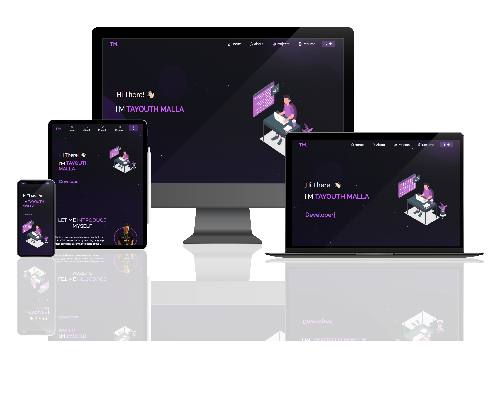

<h2 align="center">
  Portfolio Website - v2.0 
  <a href="https://tayouthmalla.com.np/" target="_blank">tayouthmalla.com.np</a>
</h2>

  

 &nbsp;
 &nbsp;

## Built With

My personal portfolio <a href="https://tayouthmalla.com.np/" target="_blank">tayouthmalla.com.np</a> which features some of my past and recent projects as well as my resume and technical skills. 

This project was built using these technologies.

- React.js
- CSS3
- VsCode
- Vercel

## Features

**📖 Multi-Page Layout**

**🎨 Styled with React-Bootstrap and Css**

**📱 Fully Responsive**
